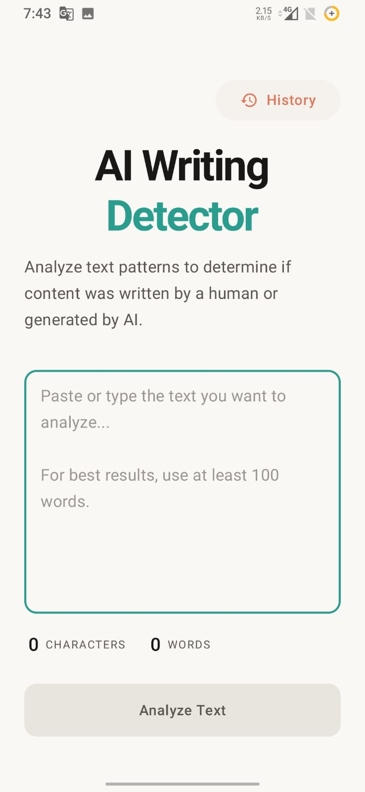
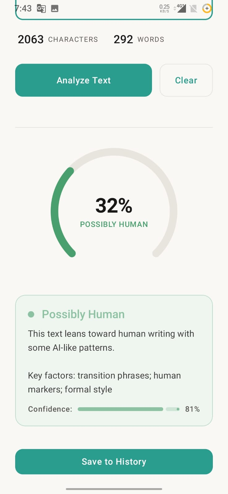
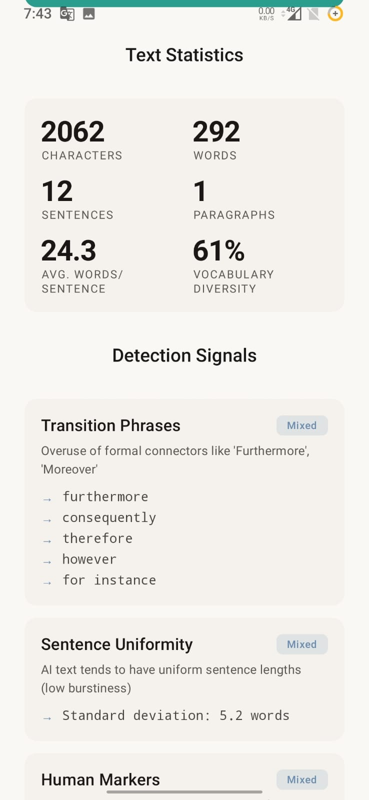
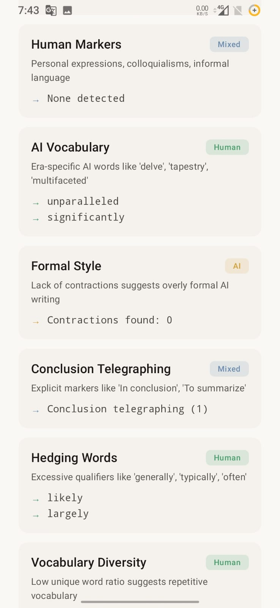
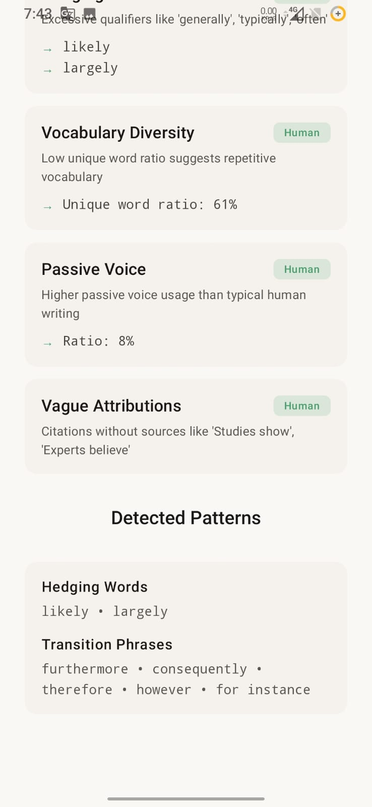

# AI Writing Detector

A Kotlin Multiplatform (KMP) application that analyzes text to determine the likelihood it was written by AI rather than a human.


## Features

- **Multidimensional Analysis**: Evaluates vocabulary, sentence structure, rhetorical patterns, and statistical properties
- **Authentication**: Google Sign-In with PASETO (Platform-Agnostic SEcurity TOkens) tokens across all platforms
- **Real-time Stats**: Live character and word count as you type
- **Detailed Reports**: Comprehensive breakdown of detection signals with evidence
- **Cross-platform**: Runs on Android, iOS, Desktop (macOS/Windows/Linux), and Web (WASM)
- **Elegant UI**: Editorial-inspired design with warm color palette

## Screenshots
    

## Detection Signals

The analyzer looks for patterns commonly found in AI-generated text:

| Signal | Description |
|--------|-------------|
| Sentence Uniformity | AI tends to produce uniform sentence lengths |
| Hedging Words | Excessive qualifiers like "generally", "typically" |
| Transition Phrases | Overuse of formal connectors like "Furthermore" |
| Vague Attributions | Citations without sources like "Studies show" |
| Passive Voice | Higher passive voice ratio than typical human writing |
| Vocabulary Diversity | Low unique word ratio suggests repetitive vocabulary |
| Formulaic Openings | Clichéd intros like "In today's world" |
| Conclusion Telegraphing | Explicit markers like "In conclusion" |

## Getting Started

### Prerequisites

- JDK 17+
- Android Studio Hedgehog+ (for Android)
- Xcode 15+ (for iOS)

### Configuration

To enable Google Sign-In, you need to set up a Google Web Client ID.

#### Create Google Web Client ID
1. Go to the [Google Cloud Console](https://console.cloud.google.com/).
2. Select your project (the same one used for Firebase).
3. Navigate to **APIs & Services** > **Credentials**.
4. If you haven't configured the OAuth consent screen, complete that first under the **OAuth consent screen** tab.
5. Click **+ CREATE CREDENTIALS** and select **OAuth client ID**.
6. Choose **Web application** as the **Application type**.
7. Name your client (e.g., `AI Writing Detector Web`).
8. Add **Authorized JavaScript origins** (e.g., `http://localhost:8080` for local web development).
9. Click **Create** and copy the **Client ID**.

#### Update local.properties
Add the copied Client ID to your `local.properties` file in the project root:
```properties
GOOGLE_WEB_CLIENT_ID=your_google_web_client_id_here
```

### Run Android

```bash
./gradlew :composeApp:assembleDebug
```

Or open in Android Studio and run.

### Run Desktop

```bash
./gradlew :composeApp:run
```

### Run Web (WASM)

```bash
./gradlew :composeApp:wasmJsBrowserDevelopmentRun
```

### Run iOS

Open `iosApp/iosApp.xcodeproj` in Xcode and run on a simulator or device.

## Architecture

The project follows Clean Architecture principles with a multi-layered structure:

```
├── data/               # Data layer (Repositories, DB, Auth)
│   ├── auth/           # Auth implementations (Google, Token Storage)
│   ├── db/             # SQLDelight database & platform drivers
│   └── repository/     # Repository implementations
├── domain/             # Business logic layer
│   ├── analyzer/       # Core analysis logic & pattern dictionaries
│   ├── auth/           # Auth interfaces & domain models
│   ├── model/          # Domain models (AnalysisResult, TextStats)
│   ├── usecase/        # Business logic & Interactors
│   └── util/           # Shared domain utilities (NumberFormat)
├── presentation/       # UI layer (Compose Multiplatform)
│   ├── components/     # Reusable UI components
│   ├── screen/         # UI screens (Login, Splash, Detector, etc.)
│   ├── theme/          # Design system (Colors, Typography)
│   └── viewmodel/      # MVI ViewModels
├── di/                 # Koin dependency injection modules
└── App.kt              # Main Compose entry point
```

### Tech Stack

- **UI**: Compose Multiplatform
- **Architecture**: MVI + Clean Architecture
- **DI**: Koin 4.0
- **Navigation**: Voyager
- **Async**: Kotlin Coroutines

## Scoring System

The detector calculates a weighted score from 0.0 (definitely human) to 1.0 (definitely AI):

```
Final Score = Σ (weight × signal_score) / Σ weights
```

Each signal produces a score based on thresholds derived from linguistic research.

### Verdict Categories

| Score Range | Verdict |
|-------------|---------|
| 0.00 - 0.25 | Likely Human |
| 0.25 - 0.40 | Possibly Human |
| 0.40 - 0.60 | Inconclusive |
| 0.60 - 0.75 | Possibly AI |
| 0.75 - 1.00 | Likely AI |

## Limitations

This is an educational project demonstrating text analysis techniques. Important caveats:

1. **No detector is perfect**: AI writing detection is fundamentally challenging
2. **False positives**: Human academic/formal writing may trigger AI signals
3. **Model evolution**: As LLMs improve, their writing becomes less detectable
4. **Context matters**: Technical documentation naturally has different patterns than creative writing

Try testing the detector on famous texts that pre-date LLMs (before 2017) to see how challenging detection truly is!

## License

MIT License - see [LICENSE](LICENSE) for details.

## Contributing

Contributions welcome! Please read [CONTRIBUTING.md](CONTRIBUTING.md) first.

---

Built with ❤️ using Kotlin Multiplatform
